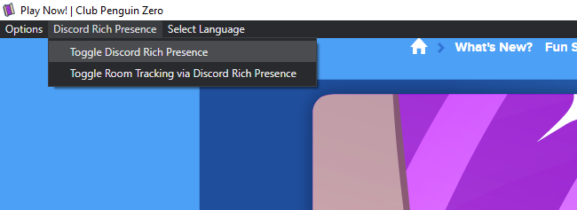
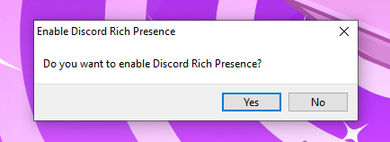

# CPZero Client

The official client for Club Penguin Zero!

## Installation

Executables are available in [releases](https://github.com/ClubPenguinZero/CPZ-Client/releases/latest) for Windows, Mac, and Linux.

## Features

- Alter the URL for any CPPS. (Can be excluded from the build if not needed.)
- Clear the cache.
- Reload and reload without cache.
- Fullscreen mode.
- Zoom with `CMD/CTRL +`, `CMD/CTRL -` and `CMD/CTRL + 0`.
- Developer tools. (inspect element)
- Ad blocker. (not included in builds - **CPZ IS NOT MONETIZED**)
- Ad blocker can be excluded from the build if not needed.
- Discord Rich Presence. (enabled by default)
- Discord Rich Presence room tracking. (enabled by default)

#### Discord Rich Presence (with room tracking!)
The client has a Discord Rich Presence function, which is enabled by default.

The client can also track the user's in-game location through Rich Presence. You can use RPC with and without tracking.

### License
This project uses the [MIT License](https://github.com/ClubPenguinZero/CPZ-Client/blob/main/LICENSE).

Modified from [Club Penguin Avalanche](https://github.com/Club-Penguin-Avalanche/CPA-Client).